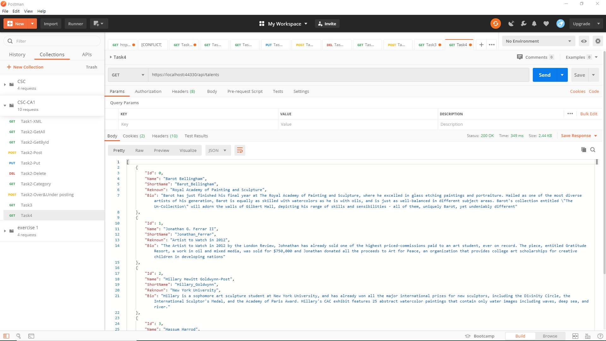
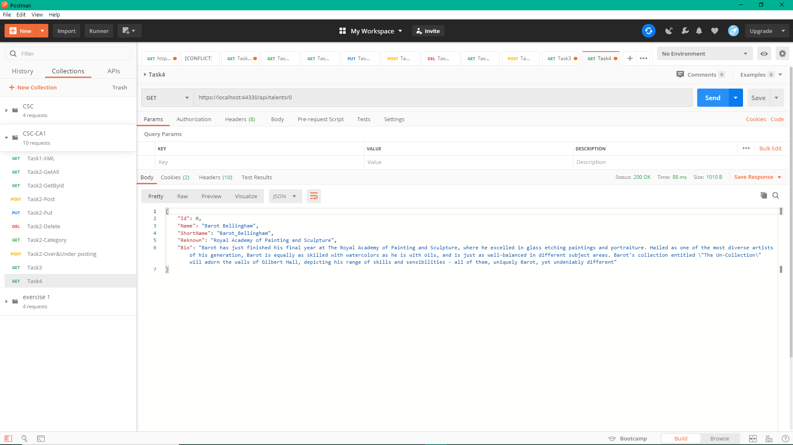

# t4
Pang Jing Hui | P1845259 

## Web API Document
| No. | HTTP Method  | Route | Description |
| ------------- | ------------- | ------------- | ------------- |
| 1. | GET | api/talents | Retrieve all the data.  |
| 2. | GET | api/talents/{id:int} | Retrieve data based on id. Route constraints let you restrict how the parameters in the route template are matched. The general syntax is "{parameter:constraint}". |

# Postman testing screenshots:
### Get all of the talents

### Get the talent by input id

