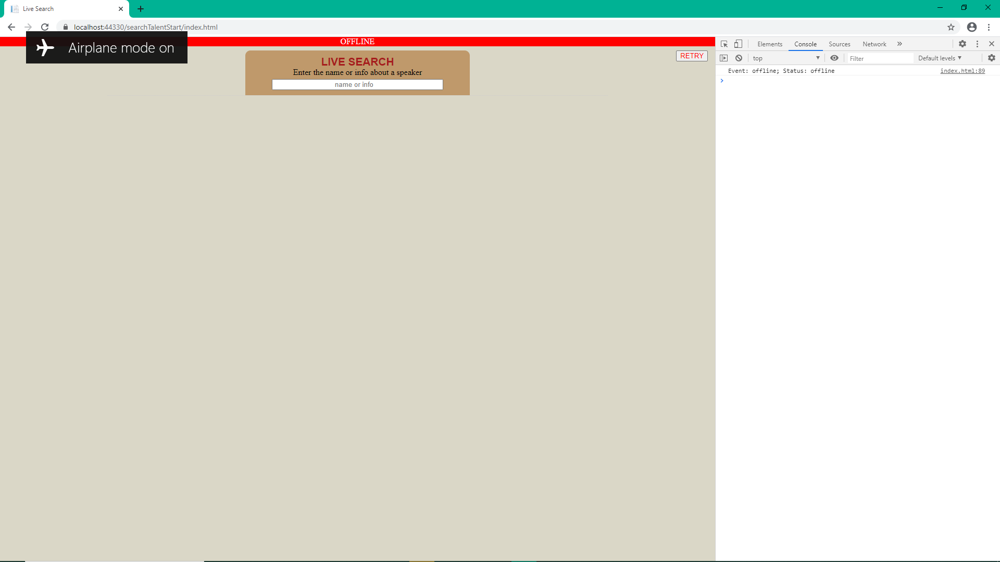
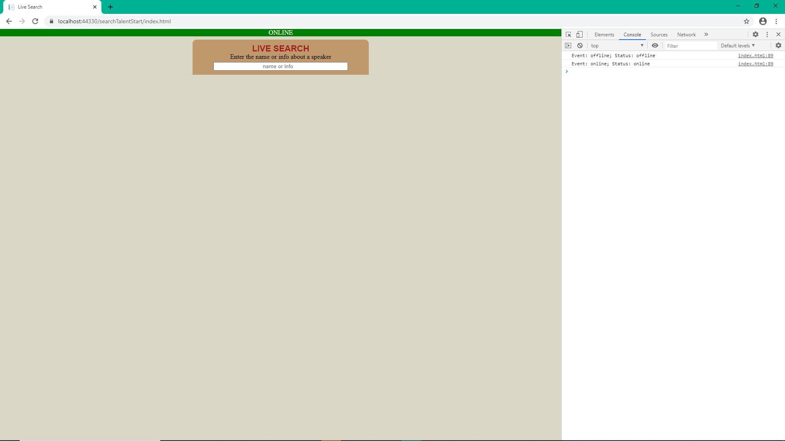
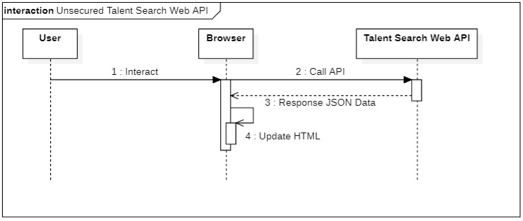
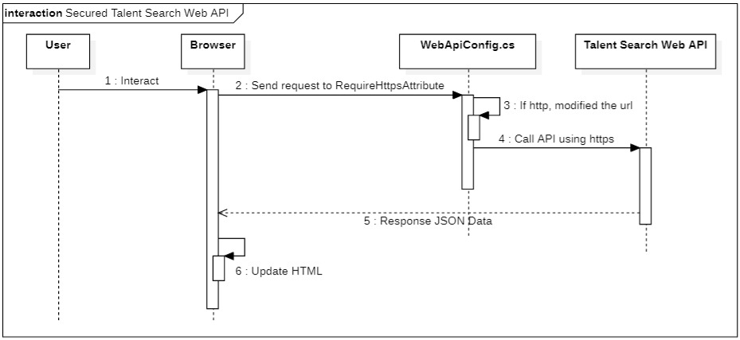

# t4
Pang Jing Hui | P1845259 

## Web API Document
| No. | HTTP Method  | Route | Description |
| ------------- | ------------- | ------------- | ------------- |
| 1. | GET | api/talents | Retrieve all the data.  |
| 2. | GET | api/talents/{id:int} | Retrieve data based on id. Route constraints let you restrict how the parameters in the route template are matched. The general syntax is "{parameter:constraint}". |

# Postman testing screenshots:
### 1. GET - Retrieve all talents

### 2. GET - Retrieve talent by id

# HTTP to HTTPS testing screenshots:
### 1. Access unsecure url

Try to access unsecure http://...

### 2. Automatically redirected to secure url

Notice it has been redirected to https://...

## Inspect

There are 2 talents methods called. 
This method get the unsecure url and return a secure url as shown below: -

Lastly, the secure url will be used to call the GET method: -

# Network failure catch:
## 1. Online

For debugging purpose, console shows the message, "Online, status: true", when the network is connected. 

## 2. Offline

The "Retry" button will be showned at the top right for user to refresh the browser, and a pop-up message prompts user to check the network connectivity. 
The console shows, "Offline: status: false".

# Sequence Diagrams
### 1. Unsecure Talent Search Web API

### 2. Secure Talent Search Web API

Note: RequireHttpsAttribute class overwrite AuthorizationFilterAttribute class as implementing if else statement to detect if the url is http or https.

# References:
1. https://www.youtube.com/watch?v=xIzlD-frEw4
2. https://www.hexacta.com/How-to-enable-CORS-on-your-Web-API

